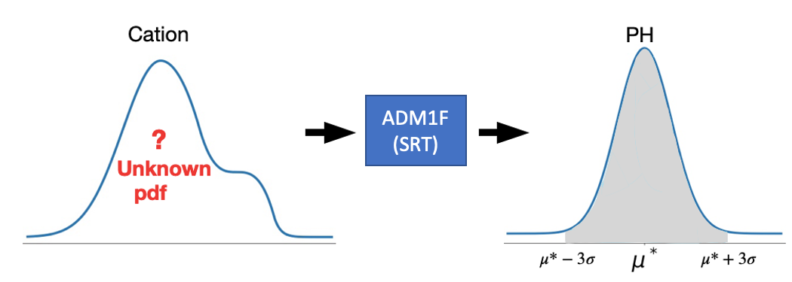

PH Control
==========

The two-phase AnDMBR simulates a rumen environment to enhance the rates of hydrolysis and acidogenesis. A large amount of volatile fatty acids that decreases PH is produced, which could lead to digester failure. In real-life conditions, sodium hydroxide is added into the first-phase reactor. This maintains a PH around 6.3 and ensures optimal microbial activities, which is similar to the rumen reactor of a cow. Similarly, the PH in the second-phase methane-producing AnDMBR is maintained at 7.2 to provide optimal reactor functionality. In the AnDMBR model, we retain the appropriate levels of PH within each reactor phase by adding corresponding cation mass, which is estimated via the data consistent inversion method [#r1]_. The cation amount can then be used to calculate the amount of sodium hydroxide in real implementation. The method and more in-depth mathematical description of the `ph-control` methods can be found in Dr. Zhang's Ph.D. thesis.  

**Data Consistent Inversion Method**

Data consistent inversion method is used here to determine the cation needed to adjust the PH level in the reactor. It is first introduced for uncertainty quantification in inverse problems in [#r1]_ where the ideas and derivations behind it were discussed in great detail. Since the goal here is to solve the inverse problem where target PH, :math:`\mu^*`, can be achieved, we can apply this method to our model. Our goal here is to control the PH in the reactor within an acceptable range. We denote the target PH value by :math:`\mu^*`, a small deviation is allowed around :math:`\mu^*` to meet real-life conditions.

Gaussian (or normal) distribution denoted by :math:`N(\mu, \sigma^2)` has a property that
there is a probability of 99.73\% that its observation denoted by :math:`X` will lie within three standard deviations (:math:`3\sigma`) of the mean (:math:`\mu`). This is the so-called three-sigma rule of thumb, to write it in mathematical notation \cite{3sigma},

.. math::

    P(\mu-3\sigma \leq X \leq \mu+3\sigma) \approx 99.73\%.

We would like to use this special property of Gaussian distribution to achieve a high chance of predicted PH being in the three standard deviations of :math:`\mu^*`. Therefore we assume that our predicted PH value follows a Gaussian distribution [#f1]_, :math:`N(\mu^*, \sigma^2)`. We first propose an initial probability  density function (pdf) of cation\footnote{A uniform distribution :math:`U(0,0.2)` is assumed in our model.}, then the data consistent inversion method is applied to update the pdf  of cation such that the pdf of :math:`N(\mu^*, \sigma^2)` is returned when the updated pdf is propagated through the model.

The following figure describes the relation between cation density, model and PH density.

The methodology of data consistent inversion [#f2]_ guarantees that when a sample of the updated pdf of cation is put in the model input, there is a probability of 99.73\% that the predicted PH will be within three standard deviations around :math:`\mu^*` (grey area). It is straightforward to get the conclusion  that the smaller :math:`\sigma` we choose in :math:`N(\mu^*, \sigma^2)`, the more accurate the PH will be.

.. toctree::

   ph12
   jupyter_notebook/ph-control

.. rubric:: References

.. [#r1] `T. Butler and J. Jakeman and T. Wildey, Combining Push-Forward Measures and Bayes’ Rule to Construct Consistent Solutions to Stochastic Inverse Problems, SIAM Journal on Scientific Computing, 40, A984-A1011 (2018). <https://epubs.siam.org/doi/abs/10.1137/16M1087229?mobileUi=0>`_

.. rubric:: Footnote

.. [#f1] We can also assume different distributions for PH.
.. [#f2] Assumptions are not discussed here for the ease of explanation.
